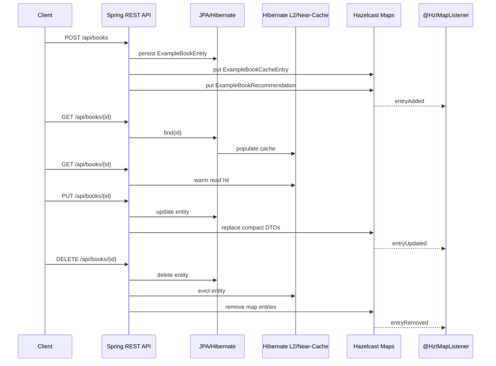

# Example Spring Boot 3 App

Runnable example for `hazelcast-toolkit` that demonstrates:

- explicit `@HzCompact(serializer = ...)` with a nested DTO
- reflective `@HzCompact` on a second map-backed type
- `@HzIMapListener` for create / update / delete map events
- Hibernate L2 with `jcache` and `hazelcast-local` profiles
- client near-cache configuration plus both REST and Actuator probe flows
- ready-to-run local setup with `compose.yaml` and [http/demo.http](http/demo.http)

## What This Example Contains

### 1. Explicit compact serializer

`ExampleBookCacheEntry` is intentionally richer than the JPA entity:

- nested `publisher` object
- nested `inventory` object
- explicit serializer registration via
  `@HzCompact(serializer = ExampleBookCacheEntryCompactSerializer.class)`

This is the example to look at when you need tight control over schema fields.

### 2. Reflective compact registration

`ExampleBookRecommendation` uses plain `@HzCompact` without a custom serializer.

This shows the lightweight path for secondary read models where reflective
compact serialization is enough.

### 3. Map listener flow

`ExampleBookCacheListener` listens on the `example-books` map and reacts to:

- insert
- update
- remove

The listener logs every event so you can see the Hazelcast side-effects of your
REST calls immediately.

### 4. L2 and near-cache flow

The example exposes:

- `GET /api/books/{id}/near-cache-demo`
- `GET /actuator/hazelcastNearCache`
- visual inspection through Hazelcast Management Center on `http://localhost:8081`

Both are useful when you want to prove that L2 + near-cache is actually working
instead of assuming it is.

## Run Hazelcast

Use Docker Compose:

```bash
docker compose -f example-spring-boot3/compose.yaml up
```

This starts:

- Hazelcast member on `localhost:5701`
- Hazelcast Management Center on `http://localhost:8081`

Or run Hazelcast directly:

```bash
docker run --rm -p 5701:5701 -e HZ_CLUSTERNAME=dev hazelcast/hazelcast:5.5.0
```

## Run The App

JCache profile:

```bash
./gradlew :example-spring-boot3:run --args="--spring.profiles.active=jcache"
```

Native Hazelcast local region-factory profile:

```bash
./gradlew :example-spring-boot3:run --args="--spring.profiles.active=hazelcast-local"
```

The app starts on `http://localhost:8080`.

On startup it seeds one book automatically, so `GET /api/books/1` works
immediately.

## Ready Demo Flow

If your editor supports `.http` files, open:

- [http/demo.http](http/demo.http)

That file walks through:

- seeded entity read
- create
- L2 warm reads
- explicit compact DTO read
- reflective compact DTO read
- update
- near-cache demo
- Actuator near-cache probe
- delete

## Key Endpoints

| Endpoint | Purpose |
|---|---|
| `POST /api/books` | create entity + explicit compact DTO + reflective DTO |
| `GET /api/books/{id}` | read JPA entity |
| `PUT /api/books/{id}` | update entity and refresh Hazelcast views |
| `DELETE /api/books/{id}` | delete entity and evict Hazelcast views |
| `GET /api/books/cache/{id}` | read explicit compact DTO |
| `GET /api/books/recommendations/{id}` | read reflective compact DTO |
| `GET /api/books/stats` | inspect Hibernate L2 counters |
| `GET /api/books/{id}/near-cache-demo` | app-level near-cache demonstration |
| `GET /actuator/hazelcastNearCache` | toolkit Actuator probe |

## Sequence



## Expected Logs

After a `POST` you should see something close to:

```text
Hazelcast map listener received book cache entry: key=2, value=ExampleBookCacheEntry{...}
```

After a `PUT`:

```text
Hazelcast map listener updated book cache entry: key=2, value=ExampleBookCacheEntry{...}
```

After a `DELETE`:

```text
Hazelcast map listener removed book cache entry: key=2
```

## Near-Cache Notes

The example enables:

- client near-cache for the `example-books` map
- client near-cache for the `example-book-recommendations` map
- near-cache for the Hibernate entity region

The app-level demo endpoint returns timings plus L2 deltas. The Actuator endpoint
is closer to how you would verify this in production.

Management Center is useful for visual confirmation of:

- `example-books`
- `example-book-recommendations`
- map entries changing after `POST` / `PUT` / `DELETE`
- client activity while you exercise near-cache flows

## Trust Checks

The module tests cover:

- explicit serializer scanning for `ExampleBookCacheEntry`
- reflective compact scanning for `ExampleBookRecommendation`
- round-trip nested compact DTO retrieval
- reflective compact DTO retrieval
- create / update / delete listener events
- recommendation map listener events
- near-cache REST demo
- built-in Actuator near-cache probe
- real HTTP flow on a random port via `TestRestTemplate`

Run them with:

```bash
./gradlew :example-spring-boot3:test
```
